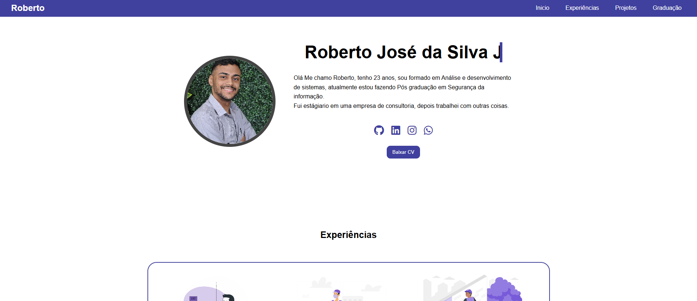

# 💼 Portfólio Profissional - Roberto José da Silva Jr.



Bem-vindo ao meu portfólio! Este projeto foi criado com o objetivo de apresentar de forma clara, visualmente atraente e responsiva minhas **experiências profissionais**, **formação acadêmica** e **projetos desenvolvidos**.  

Trata-se de uma aplicação **100% front-end** feita com **HTML5**, **CSS3** e **Font Awesome**, com foco em design limpo, responsividade e boa usabilidade.

---

## 🚀 Funcionalidades

- ✅ Página de apresentação com efeito de digitação no nome
- ✅ Menu responsivo com botão "hambúrguer" em telas menores
- ✅ Sessão de **Experiências Profissionais** com timeline visual
- ✅ Sessão de **Projetos** com links diretos e botão de "Saiba mais"
- ✅ Sessão de **Graduação e Pós-graduação**
- ✅ Botão para **download do currículo (CV)**
- ✅ Ícones sociais (GitHub, LinkedIn, WhatsApp, Instagram)
- ✅ Design totalmente **responsivo** com media queries

---

## 🧰 Tecnologias Utilizadas

- **HTML5** – estrutura semântica e acessível
- **CSS3** – estilização moderna com `flexbox`, `grid`, animações e responsividade
- **Font Awesome** – ícones sociais interativos
- **JavaScript Vanilla** – para interação do menu em dispositivos móveis

---

## 📱 Responsividade

O layout adapta-se perfeitamente a diferentes tamanhos de tela:

- Desktop 💻  
- Tablets 📱  
- Smartphones 📱

---

## 📎 Acesso ao Projeto

📂 Veja o projeto online:  
🔗 [Portfólio Roberto José](https://robertojsjtv.github.io/)

📥 Baixe o código-fonte:  
```bash
git clone https://github.com/RobertoJSJTV/portfolio-roberto.git
```
## 👨‍💼 Sobre Mim

Me chamo **Roberto José da Silva Jr.**, tenho 23 anos, sou formado em **Análise e Desenvolvimento de Sistemas** e atualmente curso **Pós-graduação em Segurança da Informação.** Já atuei como estagiário em consultoria, entregador no Mercado Livre e atualmente atuo como administrador de obras.

## 📇 Contato

Entre em contato comigo através de:

- 💼 [LinkedIn](https://www.linkedin.com/in/robertojsjunior/)

- 💻 [GitHub](https://github.com/RobertoJSJTV)

- 📱 [WhatsApp](https://wa.me/11967863000)

- 📸 [Instagram](https://www.instagram.com/robertoo_sjr/)

